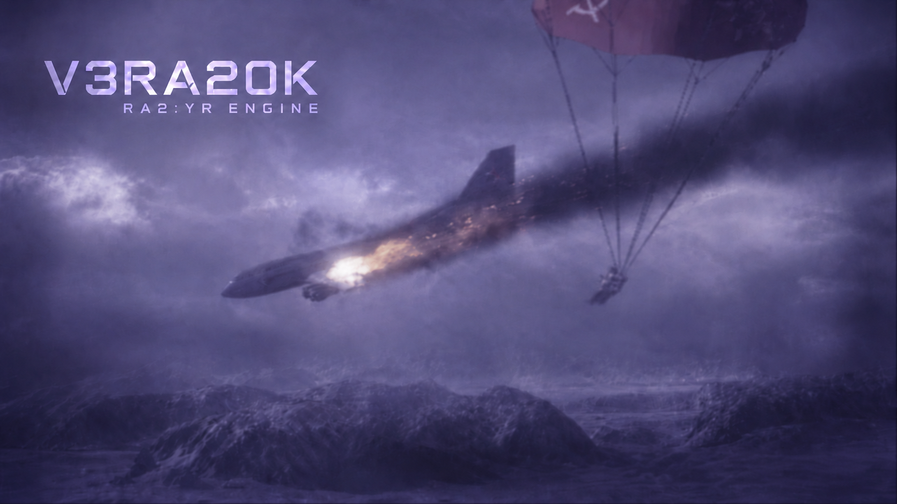

<p align="center" dir="ltr">
  <a href="README.sv.md" lang="sv">Svenska</a> · <strong>简体中文</strong> · <a href="README.de.md" lang="de">Deutsch</a> · <a href="README.ar.md" lang="ar" dir="rtl">العربية</a> · <a href="README.ru.md" lang="ru">Русский</a> · <a href="README.th.md" lang="th">ไทย</a> · <a href="README.tr.md" lang="tr">Türkçe</a> · <a href="README.md" lang="en">English</a>
  &nbsp;&nbsp;
  <a href="https://github.com/YuriPlanet/vera20k/actions/workflows/macos.yml?query=branch%3Amain" title="最近一次手动运行的 macOS 库测试"></a>
  <a href="https://github.com/YuriPlanet/vera20k/actions/workflows/linux.yml?query=branch%3Amain" title="最近一次手动运行的 Linux 库测试"></a>
  <a href="https://github.com/YuriPlanet/vera20k/actions/workflows/windows.yml?query=branch%3Amain" title="最近一次手动运行的 Windows 库测试"></a>
  <a href="https://discord.gg/kmjRUn5m5F"></a>
  
</p>

# VERA20k

VERA20k 是对原版引擎 `gamemd.exe` 的重写。它使用原版游戏文件，因此你需要自行准备一份《红色警戒2：尤里的复仇》。

VERA20k 由玩家打造、为玩家而做，项目的方向由玩家说了算。


## 项目目标

1. 保留原版《红色警戒2：尤里的复仇》的玩法、画面和氛围。
2. 支持更大规模的战斗：在 500×500 的地图上，容纳最多 **30 名玩家**和 **20,000 个单位**。
3. 加入新老 RTS 游戏中已有的功能，以及一些前所未见的功能。
4. 内置多人游戏客户端

## 当前进度

**开发中期。** Windows 上已可与基础 AI 进行本地遭遇战。原版地图和随机地图、菜单、基地建设、采矿、战斗，
以及存档和读档都已具备，但还有很多需要修复和完善的地方。

多人联机、战役和原版 AI 尚未实现。飞行单位、心灵控制、桥梁，以及一些武器和效果仍需完善。
我们还没有验证过 30 名玩家、20,000 个单位的对战。

## 编译与运行

你需要：

- **游戏：**《红色警戒2：尤里的复仇》。
- **Rust 和 Git：** 通过 rustup 安装的最新稳定版 [Rust](https://rustup.rs/)，以及 [Git](https://git-scm.com/)。
- **构建工具：** Windows 上需要 Visual Studio 的 C++ 生成工具，Rust 安装程序会提示安装；macOS 上运行
  `xcode-select --install`；Debian 和 Ubuntu 上运行 `sudo apt install build-essential libasound2-dev pkg-config`。
- **显卡：** 支持 Vulkan、DirectX 12 或 Metal 的 GPU。

VERA20k 已在 Windows、Linux 和 macOS 上运行游玩过。

```sh
git clone https://github.com/YuriPlanet/vera20k.git
cd vera20k
cp config.toml.example config.toml
# 运行前，编辑 config.toml，将 ra2_dir 设为你的游戏文件夹：
cargo run --release --bin vera20k
```

`ra2_dir` 请使用正斜杠，例如 `C:/Games/RA2`。游玩时请使用 `--release`；调试构建运行太慢。日志保存在 `logs/ra2.log`。

## 我们如何开发

大部分代码由 AI 编程助手编写。它们用 Ghidra 研究原版引擎，再将其行为移植到 Rust，
通过[对比工具](tools/native_oracle.md)和实际游玩进行检查。AI 助手遵循 [AGENTS.md](AGENTS.md)。

<!-- Chinese-only section: intentionally absent from README.md and the other translations. -->
## 致中国玩家和开发者

VERA20k 的开发者都是你们的朋友。我们希望把庞大的中国红警玩家群体与世界各地的玩家联系在一起，让大家可以一起对战。

我们非常希望中国的开发者和玩家加入进来，和我们一起开发、一起游玩！
欢迎在 GitHub 上[提交 issue](https://github.com/YuriPlanet/vera20k/issues)，或者来 [Discord](https://discord.gg/kmjRUn5m5F) 或社区自建的 QQ 群（群号 1097193563）找我们。
用中文写 issue 也完全没问题。

我们还没有 QQ 群。如果你愿意为 VERA20k 建一个 QQ 群，请在 issue 或 Discord 上告诉我们，我们很乐意加入！

## 参与贡献

欢迎帮忙。你可以编写代码、重构引擎、测试游戏、提出想法，或对照原版游玩，告诉我们哪些地方感觉不对。
直接提交 PR 即可，剩下的交给我们；如果改动较大，请先在 issue、[Discord](https://discord.gg/kmjRUn5m5F) 或社区自建的 QQ 群（1097193563）里问一下。

游戏逻辑在 `src/sim/`，渲染在 `src/render/`，菜单和输入在 `src/app/` 和 `src/ui/`；
你不需要 `tools/` 中的 Python 工具。[架构概览](https://yuriplanet.github.io/vera20k/zh-CN/)介绍了引擎各部分如何协作。
用 `cargo test -p vera20k --lib` 运行测试。需要游戏 INI 文件的测试会自动跳过，但仍计为通过，
直到你运行 `cargo run --bin extract-ini [游戏文件夹]`。

贡献内容与项目其余部分一样采用 GPLv3 许可证；无需签署 CLA。

## 致谢与法律声明

感谢 OpenRA、XCC Mixer、ModEnc wiki、Project Perfect Mod、EA 以 GPL 许可证发布的
《命令与征服》和《红色警戒》源码、World-Altering Editor、Final Alert、YRpp、Ares、Phobos，
以及其他为此做出贡献的项目和社区。

本项目采用 [GPLv3](LICENSE-GPL) 许可证。本仓库不包含游戏文件。
Command & Conquer 和 Red Alert 是 Electronic Arts Inc. 的商标，截图中的游戏美术资源归 Electronic Arts 所有。
VERA20k 与 Electronic Arts 无隶属关系，也未获其认可。

本文件译自 [README.md](README.md)，请与英文版保持同步。
